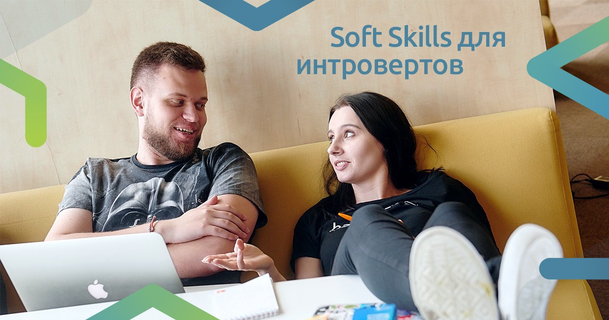

## Санкт-Петербург, 11 июля

_Никита и Саша._

Чтобы быть успешным разработчиком, одних навыков программирования в 2019 году недостаточно. Кроме знаний технологий, нужно развивать коммуникабельность, тайм-менеджмент, лидерские качества и много всего другого. Но что делать, если вы заядлый интроверт и хотите писать только код?

11 июля в Санкт-Петербурге пройдёт мастер-класс Саши Шинкевич и Никиты Дубко. На мастер-классе мы обсудим, как развивать soft skills и почему это важно, даже если вы не собираетесь завоёвывать мир.

Мастер-класс пройдёт 11 июля в офисе Контура в бизнес-центре «Сенатор» на Большой Пушкарской, 22. Начало в 19:00, конец в 21:30. Регистрация обязательная, мест совсем немного. Поторопитесь!

Есть вопросы? Пишите: [wst@web-standards.ru](mailto:wst@web-standards.ru).

## Регистрация

<iframe src="https://docs.google.com/forms/d/e/1FAIpQLScm1loPf9enjBHIWVCdpaHy5xFAt6_v8zPDFTVyfDfJ4EMPqA/viewform?embedded=true">
[Форма на отдельной странице.](https://docs.google.com/forms/d/e/1FAIpQLScm1loPf9enjBHIWVCdpaHy5xFAt6_v8zPDFTVyfDfJ4EMPqA/closedform)